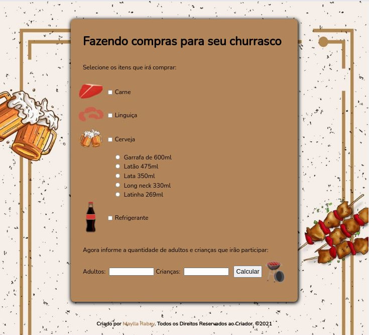
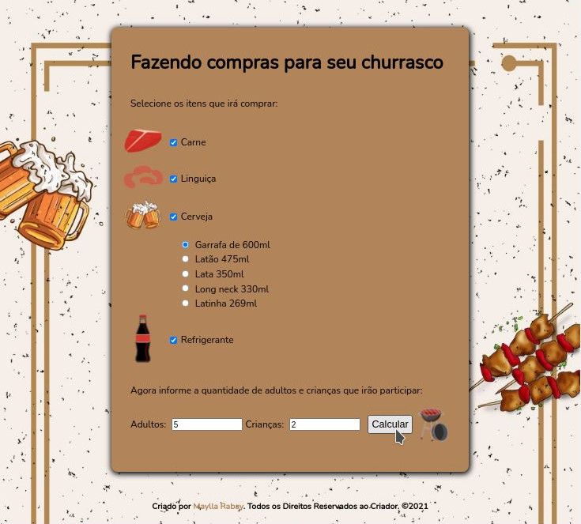
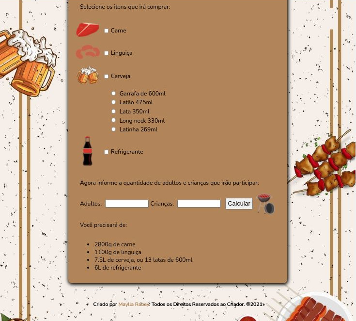

<h1 align="center">
  
</h1>

<h2 align="center"> 
	🚀 Calculadora de Churrasco 🚀
</h2>

## 💻 Sobre o projeto
  Um site que calcula a quantidade de bebidas e alimentos necessários para um churrasco de acordo com o número de adultos e crianças que comparecerão, tudo sendo escolhido pelo usuário. Feito para treinar meu conhecimento principalmente em Javascript e DOM (Document Object Model - graças à esse objeto, podemos acessar as propriedades dos elementos da página e interagir com eles).

### Quantidades utilizadas para o cálculo
  
Por adulto:

  <ul>
    <li>Carne: 500g</li>
    <li>Linguiça: 200g</li>
    <li>Cerveja: 1.5L</li>
    <li>Refrigerante: 1L</li>
  </ul>

  
Por criança:

  <ul>
    <li>Carne: 150g</li>
    <li>Linguiça: 50g</li>
    <li>Refrigerante: 500mL</li>
  </ul>

## 🎨 Layout
  Design próprio, com imagens retiradas da internet e editadas no GIMP. Cores utilizadas:
  - rgb(233, 155, 83) (laranja)
  - #f6efe9 (bege claro)
  - #b2845a (marrom)
  - black (preto)

## 🛠 Tecnologias
  - 
  - 
  - 
  - 

Feito com ❤️ por Maylla Rabay 👋 [Entre em contato!](https://www.linkedin.com/in/mayllarabay/)

